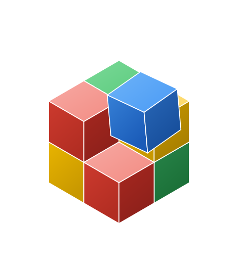
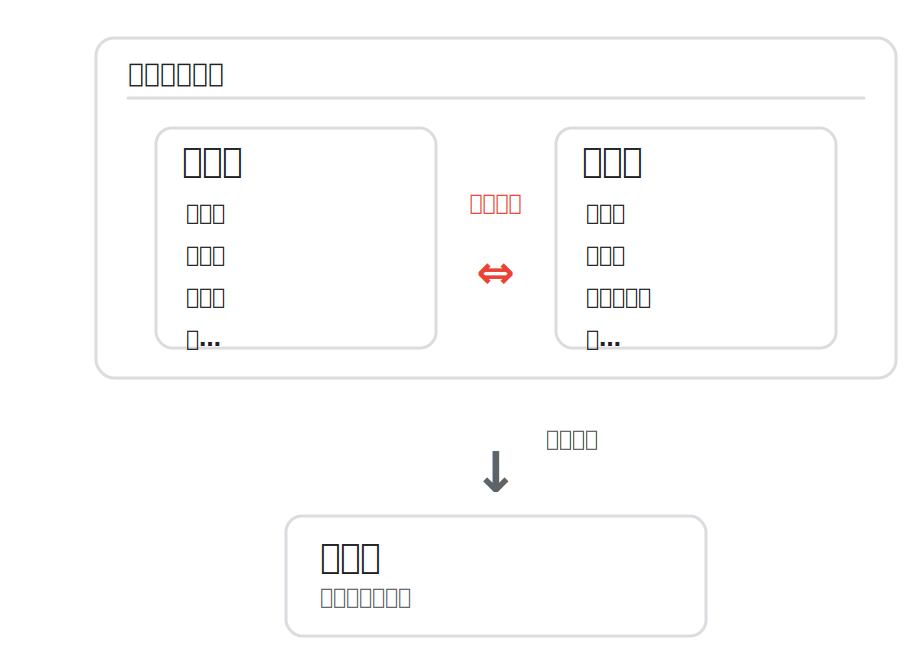
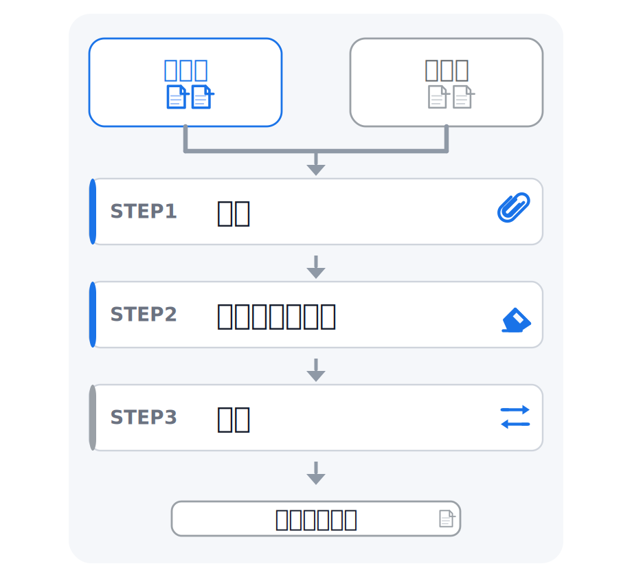
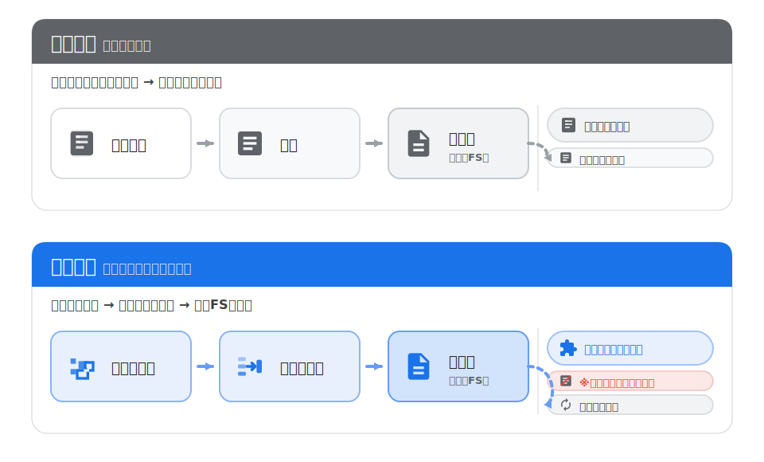
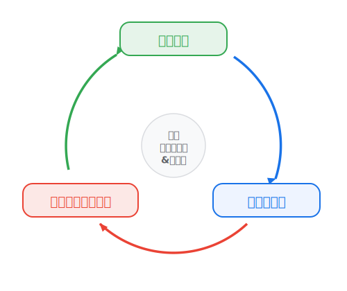
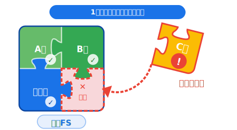
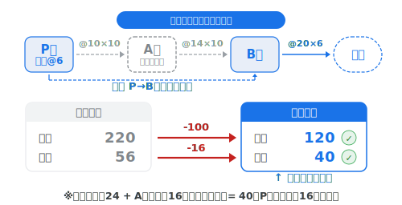

<!-- _class: lead cover -->
<!-- _paginate: false -->
<!-- _footer: "" -->

  

    

      連結決算の特徴と
      業務プロセス
    

    
財務勉強会

  

  

    
  

  
連結財務Gr 小谷 森下

<!-- 作成元：財務勉強会‗連結決算プロセスの実際_小谷追記.docx -->

---

<!-- _class: goals -->
## 今日のゴール

  

    
01

    

      
連結決算の特徴について、個別決算と対比させて理解する

    

  

  

    
02

    

      
1を背景に、マツダの連結決算業務プロセスを理解する

    

  

  

    
03

    

      
2の例として、UPI（未実現利益）の計算プロセスを理解する

    

  

---

<!-- _class: agenda -->
## 目次

  

    
1

    
連結決算の特徴

    

      （1）連結会計とは（前回のおさらい）
      （2）個別決算との違い
    

  

  

    
2

    
マツダの連結決算業務プロセス

    

      （1）連結範囲
      （2）連結PKG
      （3）決算締日から決算発表日までの流れ
    

  

  

    
3

    
UPI（未実現利益）

    

      UPIの計算プロセス
    

  

---

<!-- _class: concept -->
## （1）連結会計とは（前回のおさらい）

企業グループ全体を “単一の組織”として捉える

連結では、内部取引は相殺（消去）し、 第三者（グループ外）との取引のみを認識

---

<!-- _class: procedure -->
## （1）連結の基本手続き（前回のおさらい）

  

    
基本的な手続き： 合算 → 修正 → 組替

    
各社の個別FSを合算し、内部取引等を修正 開示形式へ組替えて連結FSを作る

  

  

    
  

---

<!-- _class: contrast -->
## （2）個別決算との違い

  

    

      単体＝日記のイメージ 
      連結＝パズルのイメージ
    

    

      単体は、仕訳が元帳に積み上がり、そのまま個別FSになる 
      連結は、期末に各社データを収集し、合算・修正して連結FSを作る
    

  

  

    
  

---

<!-- _class: contrast -->
## （2）個別決算との違い

  

    

      連結帳簿は存在しない
    

    

      決算が終われば連結のデータは一度解散（リセット）される 翌期はまた開始仕訳（前年度までの修正の引き継ぎ）から再スタートする
    

  

  

    
  

---

<!-- _class: contrast -->
## （2）個別決算との違い

  

    

      帳簿がないからこそ、 
      データ収集プロセスの構築が重要
    

    

      連結FSは各社データを合わせて初めて完成 
      1社でもデータが欠けると完成しない（各社の数値は正しい前提）
      
⇒ データ収集の仕組み構築と全体理解が不可欠

    

  

  

    
  

---

<!-- _class: contrast -->
## （2）個別決算との違い

  

    

      あるべき数値から逆算し 
      必要な調整を考える
    

    

      あるべき数値（＝第三者との取引）から逆算し、 
      必要な消去・調整を導く
      
⇒ 新規ビジネスや商流変更、各国トピックスの把握が肝要！

    

  

  

    
  

---

<!-- _class: feature-diff -->
## 決算締日から連結FS確定までの流れ

  

    
MCカレンダー

  

  

    

    

0WD

決算締日

    

7WD

速報

    

8WD

子会社確報

    

9WD

MC確報

    

10WD

連結FS確定

    

11WD

監査開始

  

